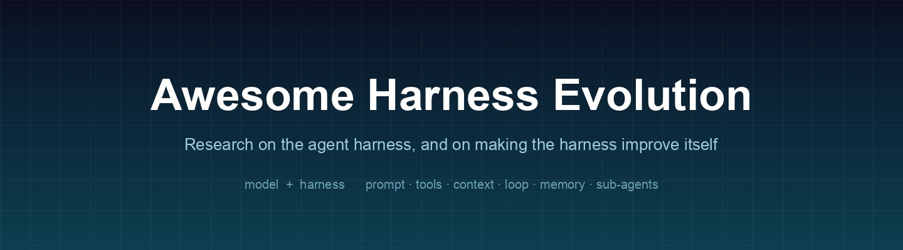

  
  <h1>Awesome Harness Evolution</h1>
  
A reading list on the agent harness and the research that automates it.

  

    
    
    
    
    
  

  

    <a href="https://zdoc.app/de/wannabeyourfriend/awesome-harness-evolution">Deutsch</a> |
    <a href="https://zdoc.app/en/wannabeyourfriend/awesome-harness-evolution">English</a> |
    <a href="https://zdoc.app/es/wannabeyourfriend/awesome-harness-evolution">Español</a> |
    <a href="https://zdoc.app/fr/wannabeyourfriend/awesome-harness-evolution">Français</a> |
    <a href="https://zdoc.app/ja/wannabeyourfriend/awesome-harness-evolution">日本語</a> |
    <a href="https://zdoc.app/ko/wannabeyourfriend/awesome-harness-evolution">한국어</a> |
    <a href="https://zdoc.app/pt/wannabeyourfriend/awesome-harness-evolution">Português</a> |
    <a href="https://zdoc.app/ru/wannabeyourfriend/awesome-harness-evolution">Русский</a> |
    <a href="https://zdoc.app/zh/wannabeyourfriend/awesome-harness-evolution">中文</a>
  

**The agent harness** is the runtime scaffold around a language model: prompt assembly, tool interfaces, context management, the control loop, sub-agent orchestration, memory, and output parsing. For a fixed model it is often the larger lever on end-to-end agent performance; [The Harness as a Variable](#the-harness-as-a-variable) collects the benchmarks that hold the model fixed and vary the harness. Until 2025 it was engineered almost entirely by hand.

The entries here **search, optimize, repair, train, co-evolve, or measure** the harness rather than the weights. The distinction is the point.

Dates are the arXiv ID month, the first-submission month. Entries in [Evidence & Critique](#evidence--critique) argue against this list's own premise: a curated list that only accumulates positive results is not useful for research.

---

## Contents

- [🏛️ Foundations](#foundations)
  - [♾️ Self-Referential Lineage](#self-referential-lineage)
- [🧬 Harness Evolution](#harness-evolution)
  - [🔍 Ahead-of-Time Search & Optimization](#ahead-of-time-search--optimization)
  - [🔄 Test-Time & Online Evolution](#test-time--online-evolution)
  - [🌀 Meta-Harness & Recursive Evolution](#meta-harness--recursive-evolution)
  - [🛠️ Repair, Diagnosis & Attribution](#repair-diagnosis--attribution)
- [🔗 Model–Harness Co-Evolution](#modelharness-co-evolution)
- [🎓 Training Models for Harness Engineering](#training-models-for-harness-engineering)
  - [✏️ Harness-Editing Policies](#harness-editing-policies)
  - [🛠️ Harness-Native RL Infrastructure](#harness-native-rl-infrastructure)
  - [⚖️ Joint Harness–Weight Optimization](#joint-harnessweight-optimization)
  - [🧭 Learned Orchestration & Topology](#learned-orchestration--topology)
  - [🏗️ Automated Agent Design & Scaffold Rewriting](#automated-agent-design--scaffold-rewriting)
- [🧩 Harness Primitives](#harness-primitives)
  - [🔄 Agent Loop & Control](#agent-loop--control)
  - [📦 Context Delivery & Compaction](#context-delivery--compaction)
  - [🧠 Memory & State](#memory--state)
  - [🔧 Tool Interfaces](#tool-interfaces)
  - [🔌 Skills](#skills)
  - [⚙️ Orchestration & Sub-Agents](#orchestration--sub-agents)
- [📐 Architecture & Empirical Studies](#architecture--empirical-studies)
- [📊 Benchmarks & Evaluation](#benchmarks--evaluation)
  - [🔬 The Harness as a Variable](#the-harness-as-a-variable)
  - [🛠️ Harness-Engineering Capability](#harness-engineering-capability)
  - [🧪 Agentic Task Benchmarks](#agentic-task-benchmarks)
- [⚖️ Evidence & Critique](#evidence--critique)
- [🌍 Environments & Environment Evolution](#environments--environment-evolution)
- [🏭 Real-World Harnesses & Infrastructure](#real-world-harnesses--infrastructure)
- [🔭 Surveys](#surveys)
- [✍️ Position Papers & Technical Blogs](#position-papers--technical-blogs)
  - [📜 Founding Texts](#founding-texts)
  - [🔧 Harness Evolution in Practice](#harness-evolution-in-practice)
  - [🧱 Context and Tool Engineering](#context-and-tool-engineering)
  - [📄 Position Papers](#position-papers)
- [📚 Related Awesome Lists](#related-awesome-lists)
- [🤝 Contributing](#contributing)
- [📄 License](#license)

---

## Foundations

Definitional and lineage work: what a harness *is*, and the programs that first improved their own scaffolding.

- [What makes a harness a harness: necessary and sufficient conditions for an agent harness](https://arxiv.org/abs/2606.10106) — Macedo, 2026-06. Notes that "harness" has become polysemous (sometimes the shipped product, sometimes the evaluation scaffold) and proposes four necessary and sufficient elements, checked against Claude Code, Codex CLI, Aider, Cline, OpenHands, and SWE-agent. The most direct inclusion test available.
- [Harness Engineering: Anatomy, Architecture, and Evolution of Coding Agents — A Source-Code Study of Eleven Systems](https://arxiv.org/abs/2609.00006) — Barbaste et al., 2026-09. Reverse-engineers eleven production coding agents into a common harness anatomy (loop, tools, context management, safety controls, orchestration, extension surfaces). The best available empirical grounding for what the *editable surface* actually is, which is what any evolution method has to operate on.
- [ReAct: Synergizing Reasoning and Acting in Language Models](https://arxiv.org/abs/2210.03629) — Yao et al., 2022-10. The Thought/Action/Observation loop nearly every harness implements. Historical placement: the loop is the fixed substrate that harness evolution now edits.
- [Self-Taught Optimizer (STOP): Recursively Self-Improving Code Generation](https://arxiv.org/abs/2310.02304) — Zelikman et al., 2023-10. A scaffolding program that improves its own scaffolding. The earliest direct precedent for the whole line.
- [Darwin Gödel Machine: Open-Ended Evolution of Self-Improving Agents](https://arxiv.org/abs/2505.22954) — Zhang et al., 2025-05. Archive-based open-ended self-modification with the model frozen and the harness self-edited. The single most-cited ancestor of harness evolution, and the clearest statement that the self-modified artifact is the scaffold, not the weights.
- [Externalization in LLM Agents: A Unified Review of Memory, Skills, Protocols and Harness Engineering](https://arxiv.org/abs/2604.08224) — Zhou et al., 2026-04. Frames agent progress as movement "from weights to context to harness," locating harness engineering alongside memory, skills, and protocols as externalization axes.
- [Code as Agent Harness](https://arxiv.org/abs/2605.18747) — Ning et al., 2026-05. Positions code as the operational substrate for agent reasoning, acting, and verification rather than merely the output, organized as interface → mechanisms → scaling over shared code artifacts. The clearest argument for *why* executable harnesses are evolvable in a way prompt-only scaffolds are not.
- [Natural-Language Agent Harnesses](https://arxiv.org/abs/2603.25723) — Pan et al., 2026-03. Externalizes control logic as portable natural-language artifacts run by a shared runtime, so harness design can be inspected, versioned, and transferred instead of buried in bespoke controller code.
- [Agents Learn Their Runtime: Interpreter Persistence as Training-Time Semantics](https://arxiv.org/abs/2603.01209) — May et al., 2026-03. Controlled experiment isolating interpreter state persistence: mismatching deployment persistence to the model's training-time semantics yields either ~80% missing-variable errors or ~3.5× token overhead. Evidence that some harness choices are learned semantics to be honored, not free parameters.

### Self-Referential Lineage

- [Language Agents as Optimizable Graphs](https://arxiv.org/abs/2402.16823) — Zhuge et al., 2024-02. GPTSwarm models agents as computational graphs and optimizes node prompts *and* graph connectivity, the origin point for treating topology as a searchable object.
- [Gödel Agent: A Self-Referential Agent Framework for Recursive Self-Improvement](https://arxiv.org/abs/2410.04444) — Yin et al., 2024-10. Agents alter their own logic steered only by high-level prompting, with no predefined optimization routine.
- [SGM: A Statistical Gödel Machine for Risk-Controlled Recursive Self-Modification](https://arxiv.org/abs/2510.10232) — Wu et al., 2025-10. Replaces Gödel-machine proofs with confidence tests and a global error budget, admitting self-edits only when superiority is certified. The formal answer to "when is a self-edit safe to keep."
- [The Red Queen Gödel Machine: Co-Evolving Agents and Their Evaluators](https://arxiv.org/abs/2606.26294) — Iacob et al., 2026-06. Attacks the fixed-verifier assumption that every other self-improvement loop depends on, by co-evolving the evaluator alongside the agent. Includes direct evidence that a fixed reviewer over-accepts.
- [Mendel Gödel Machine: Recursive Self-Improving Coding Agents via Comparative Evolution](https://arxiv.org/abs/2608.07645) — Liu et al., 2026-08. Adds multi-task mutation and cross-lineage hybridization to clonal self-modification, with convergence proofs under an additive fitness landscape.

---

## Harness Evolution

### Ahead-of-Time Search & Optimization

The harness is found before deployment, by search or by an outer optimization loop.

- [JIT-Agent: Scaling Harness Intelligence via Just-in-Time Harness Evolution](https://arxiv.org/abs/2608.25593) — Zhang et al., 2026-08. Trains a harness model to synthesize task-adaptive harnesses on the fly for arbitrary off-the-shelf agentic LLMs, formalizing the harness as a machine-generatable artifact under a fixed four-module protocol. Reports gains on DeepSearchQA, PinchBench, and OdysseyBench, and harnesses competitive with mature runtimes.
- [Meta-Harness: End-to-End Optimization of Model Harnesses](https://arxiv.org/abs/2603.28052) — Lee et al., 2026-03. An outer-loop optimizer over the code deciding what to store, retrieve, and present to the model, motivated by the observation that existing text optimizers compress feedback too aggressively for this setting.
- [AutoHarness: improving LLM agents by automatically synthesizing a code harness](https://arxiv.org/abs/2603.03329) — Lou et al., 2026-03. Synthesizes runtime constraint code from tool schemas and task specs, motivated by concrete failure data (78% of Gemini-2.5-Flash losses in a Kaggle GameArena chess competition came from illegal moves). Moves constraint enforcement from static schema validation to synthesized code guards.
- [Agentic Harness Engineering: Observability-Driven Automatic Evolution of Coding-Agent Harnesses](https://arxiv.org/abs/2604.25850) — Lin et al., 2026-04. A closed loop for evolving coding-agent harnesses, naming three obstacles that make automation hard: a heterogeneous action space across editable components, trajectories too voluminous to attribute blame through, and edits whose effect is hard to isolate. Observability is the proposed answer.
- [HARBOR: Automated Harness Optimization](https://arxiv.org/abs/2604.20938) — Sengupta & Wang, 2026-04. Argues harness design (context compaction, tool caching, semantic memory, trajectory reuse, speculative tool prediction) is a first-class machine-learning problem, since the harness dominates long-horizon agents in lines of code and operational complexity.
- [HarnessCompass: Guiding Automatic Harness Evolution toward Generalizable and Effective Agent Harnesses](https://arxiv.org/abs/2608.01918) — Zhang et al., 2026-08. Identifies two failure modes in existing automatic harness evolution (overfitting to the evolution tasks, and relying exclusively on trajectory-derived signals) and adds guidance to counter them.
- [StarHarness: Evolving Harnesses with Stratified Search for Enterprise Environments](https://arxiv.org/abs/2608.24804) — Esakkiraja et al., 2026-08. Stratifies search by baseline failure mode and strictly separates proposer-visible, proposer-invisible, and held-out task sets, with model weights fixed. The strictest train/held-out separation in the line.
- [DarwinX: Evolving Agent Harnesses Through Natural Selection](https://arxiv.org/abs/2608.07545) — Zhang et al., 2026-08. Population-based rather than single-lineage harness search, with a preserve-and-extend contract and a recombination archive. Motivated explicitly by the gap between in-loop proxy scores and held-out performance.
- [HarnessBank: Semantic Gene-Bank Search with Gated Verification for Agent-Harness Self-Evolution](https://arxiv.org/abs/2607.13683) — Luo et al., 2026-07. Treats harness evolution as retrieval-plus-verification: a reusable bank of harness edits with gated verification, rather than fresh proposal each round.
- [AutoSaddler: Automatic Harness Optimization with Durable Updates from Agent Execution Traces](https://arxiv.org/abs/2608.23041) — Park et al., 2026-08. Frames harness improvement as offline learning over mini-batches of failures (trace diagnosis, structured code patches, validation-gated selection) so that updates are durable rather than reactive.
- [Ecdysis: Efficient and Effective Training of Runtime Harnesses for LLM Agents](https://arxiv.org/abs/2609.11677) — Yue et al., 2026-09. Uses batch-level aggregation of cross-instance failures to separate model-specific deficiencies from harness-level ones, which is the attribution problem every harness trainer faces.
- [HarnessX: A Composable, Adaptive, and Evolvable Agent Harness Foundry](https://arxiv.org/abs/2606.14249) — Chen et al., 2026-06. A foundry rather than a method: composition plus adaptation plus evolution, aimed at the situation where each new model or task still demands bespoke scaffolding and execution traces are rarely distilled back into improvement.
- [Better Harnesses, Smaller Models: Building 90% Cheaper Agents via Automated Harness Adaptation](https://arxiv.org/abs/2607.08938) — Yang et al., 2026-07. Maps failure modes to harness-adaptation strategies and targets cost rather than peak accuracy. The strongest cost-side evidence that harness choice can partly substitute for model scale.
- [Scaling Laws for Agent Harnesses via Effective Feedback Compute](https://arxiv.org/abs/2605.29682) — Zhang et al., 2026-05. Argues raw test-time expenditure cannot distinguish useful feedback from redundant interaction, and proposes effective feedback compute as the measurable quantity.
- [Verify Smarter, Evolve Further: Efficient Harness Evolution through Behavior-Aware Verification](https://arxiv.org/abs/2608.27311) — Xu et al., 2026-08. Targets the field's main compute bottleneck: the cost of verifying candidate harness edits.

### Test-Time & Online Evolution

- [TTHE: Test-Time Harness Evolution](https://arxiv.org/abs/2607.08124) — Nie et al., 2026-07. Argues optimizing a harness before deployment and freezing it limits adaptation, and evolves the executable harness at test time. One of the cleanest statements of the AOT-versus-test-time split.
- [Adaptive Auto-Harness: Sustained Self-Improvement for Agentic System Deployment on Open-Ended Task Streams](https://arxiv.org/abs/2606.01770) — Liu et al., 2026-06. Points out that auto-harness systems such as A-Evolve, GEPA, and Meta-Harness are evaluated on fixed offline benchmarks, while real deployments present open-ended task streams with growing histories and heterogeneous requirements.
- [Self-Harness: Harnesses That Improve Themselves](https://arxiv.org/abs/2606.09498) — Zhang et al., 2026-06. Runs an iterative mine-weakness → propose-harness → validate-proposal loop with no human engineer and no stronger supervising agent, motivated by the fact that effective harness design is model-specific and so does not scale by hand.
- [Evolving Agents in the Dark: Retrospective Harness Optimization via Self-Preference](https://arxiv.org/abs/2606.05922) — Pan et al., 2026-06. Removes the ground-truth validation set that almost every harness-optimization method assumes, using self-preference over retrospective trajectories instead. Relevant wherever labeled data for the target task does not exist.
- [EvolveNet: Collaborative Harness Evolution for Agent Self-Improvement](https://arxiv.org/abs/2608.04968) — Nie et al., 2026-08. Challenges the assumption that all execution experience should route to a single optimizer, evolving a network of harnesses collaboratively instead.
- [Hierarchical Self-Improvement: A Framework for Task-Specific Evolvable Agent Harnesses](https://arxiv.org/abs/2608.08466) — Zhou, 2026-08. Gives each task family its own harness, hot-swapped through a fixed injection seam and rewritten from environment feedback, with the model frozen throughout.
- [Continual Harness: Online Adaptation for Self-Improving Foundation Agents](https://arxiv.org/abs/2605.09998) — Karten et al., 2026-05. Reset-free online harness adaptation *within a single episode*, for embodied agents facing long-horizon partial observability. The clearest "adapt during the run, not between runs" paper.
- [Adapting the Interface, Not the Model: Runtime Harness Adaptation for Deterministic LLM Agents](https://arxiv.org/abs/2605.22166) — Xu et al., 2026-05. Positions runtime interface adaptation as a cheaper complement to model-centric agent training.
- [Learning to Control LLM Agent Harnesses with Offline Reinforcement Learning](https://arxiv.org/abs/2607.05458) — Yi & Song, 2026-07. Formalizes harness operation as a finite-horizon Harness MDP, with a lightweight controller selecting structural execution actions while the LLM stays frozen. The most explicit control-theoretic framing of harness operation.
- [PILOT in the Loop: Live Self-Improvement for Long-Horizon Agents](https://arxiv.org/abs/2608.26530) — Xiao et al., 2026-08. Improves from experience during execution rather than only after the episode ends.
- [Recursive Experiential-Working Memory Evolution for Long-Horizon Agent Harnesses](https://arxiv.org/abs/2608.24876) — Yu et al., 2026-08. Targets the memory and context-management component specifically, motivated by growing histories that obscure task state and misalign skill invocation.
- [Harness Continual Learning: Continual Adaptation Beyond Model Parameters](https://arxiv.org/abs/2608.19013) — Kang et al., 2026-08. Reframes continual learning as happening in the harness rather than the weights. A useful conceptual anchor for the whole list.
- [Living-Harness Is an Interactive-Agent Evolver](https://arxiv.org/abs/2607.26598) — Du et al., 2026-07. Addresses the observation that post-episode failures recur because experience is not folded back into the harness, and makes evolution continuous rather than round-based.
- [EvoUndo: Recoverability-Constrained Self-Evolution for LLM Agent Harnesses](https://arxiv.org/abs/2608.28363) — Sah et al., 2026-08. Adds recoverability constraints so that harmful harness edits are undoable, the safety framing of the same loop.
- [DemoEvolve: Overcoming Sparse Feedback in Agentic Harness Evolution with Demonstrations](https://arxiv.org/abs/2605.24539) — Che et al., 2026-05. Studies harness evolution as sample-efficient fast adaptation and injects demonstrations to handle sparse, scalar feedback.
- [DREvo: Distilling Recalibrated Historical Experience for Harness Self-Evolution](https://arxiv.org/abs/2607.26722) — Guo et al., 2026-07. Compresses and recalibrates historical experience rather than replaying it raw, a counterpoint to the "keep every trace in a filesystem" default.
- [HarnessEvolve: Learning from Reference Trajectories for Reliable Agent Self-Evolution](https://arxiv.org/abs/2609.00829) — Jiang et al., 2026-09. Grounds harness edits in reference trajectories, targeting the unreliable, ungrounded edits that plague self-evolution loops.
- [RobustSGPO: Search-Space Control for Agent Harness Evolution](https://arxiv.org/abs/2609.09646) — Zhao et al., 2026-09. Constrains the *search space* rather than the proposal policy, leaving the edit scope and operation choice less unconstrained than semantic-gradient optimization does.
- [From General Agents to RCA Experts: A Self-Evolving Harness for Root Cause Analysis](https://arxiv.org/abs/2608.25661) — Huang et al., 2026-08. A production-domain vertical: a self-evolving harness for root-cause analysis, where the general agent is specialized by evolving its harness rather than its weights.

### Meta-Harness & Recursive Evolution

The evolution loop itself becomes the object of optimization.

- [The Last Harness You'll Ever Build](https://arxiv.org/abs/2604.21003) — Seong et al., 2026-04. Nests an inner harness-evolution loop inside an outer meta-evolution loop. The clearest statement of the recursive framing, and the paper that most directly invites the "does this actually compound?" critique.
- [SKIMIX: Multi-Agent Harness-Time Scaling with Skill Mixture for Dynamic Harness Engineering](https://arxiv.org/abs/2607.27994) — Luo, 2026-07. Frames harness engineering as a test-time-scaling problem with a skill mixture over multiple editing agents.
- [Harness Handbook: Making Evolving Agent Harnesses Readable,Navigable, and Editable](https://arxiv.org/abs/2607.13285) — Wang et al., 2026-07. Treats harness *legibility* as the bottleneck for automated editing, complementing the observability approach.
- [AutoDesign: Meta-Harness Optimization for Long-Horizon Agentic Design](https://arxiv.org/abs/2608.13560) — Luo et al., 2026-08. Extends meta-harness optimization beyond coding and QA into long-horizon multimodal design tasks.
- [MOSS: Self-Evolution through Source-Level Rewriting in Autonomous Agent Systems](https://arxiv.org/abs/2605.22794) — Cai et al., 2026-05. Rewrites the whole agent system at the source level, on the grounds that deployed agentic systems are otherwise static and recurring failures persist until a human ships an update.

### Repair, Diagnosis & Attribution

Evolved harnesses break. Before you can fix one, you have to know what is broken.

- [From Failed Trajectories to Reliable LLM Agents: Diagnosing and Repairing Harness Flaws](https://arxiv.org/abs/2606.06324) — Chen et al., 2026-06. Builds a harness-aware trace representation linking runtime steps to the artifacts that shaped them, then applies scoped repair operators with regression-aware validation. Argues existing methods modify the harness without first diagnosing which component is at fault.
- [Harness-R1: Learning to Edit Executable Runtime Harnesses from Agent Failure Trajectories](https://arxiv.org/abs/2608.02276) — Shao et al., 2026-08. Failure-conditioned, lifecycle-aware harness editing: the model learns to edit the executable harness from the failures it produced. The clearest instance of *training* rather than prompting a harness engineer.
- [Model or Harness? An Interaction-Centric Taxonomy for Localizing Agent Failures](https://arxiv.org/abs/2607.28802) — Raj et al., 2026-07. Attribution taxonomy for deciding whether a failure belongs to the model or the harness, the diagnosis layer the whole evolution loop depends on.
- [Don't Blame the Large Language Model: How Agent Harness Evolution Shapes Coding Agent Quality](https://arxiv.org/abs/2607.03691) — Sghaier et al., 2026-07. Empirical study quantifying how much coding-agent quality variance is harness-driven rather than model-driven. Read alongside the critique section.

---

## Model–Harness Co-Evolution

Work that refuses to hold the model fixed. The harness becomes a training-time object because it determines what traces the model learns from.

- [Recursive Harness Self-Improvement](https://arxiv.org/abs/2607.15524) — Lee et al., 2026-07. Introduces harness-in-the-loop learning: harnesses are data-generating components whose traces shape future foundation models, so they should be optimized for trace quality as well as immediate performance.
- [WHALE: A Simple Recipe for Joint Harness-Weight Optimization](https://arxiv.org/abs/2609.00196) — Kim et al., 2026-09. Jointly optimizes harness and model weights, arguing isolated optimization of either leaves performance on the table. Shares authors with Meta-Harness, positioning it as the successor direction.
- [HarnessForge: Joint Harness and Policy Evolution for Adaptive Agent Systems](https://arxiv.org/abs/2606.01779) — Chen et al., 2026-06. Jointly evolves harness and policy, reporting gains over harness-only and policy-only baselines and arguing harness–policy compatibility is itself essential.
- [HELIX: Model-Harness Co-evolution for Recursive Self-Improvement](https://arxiv.org/abs/2608.13951) — Fan & Huang, 2026-08. Co-evolution framed explicitly as recursive self-improvement.
- [Co-Evolving Harnesses and Models: On-Policy Correction Helps Weaker Models Catch Up Where Imitation Fails](https://arxiv.org/abs/2609.09134) — Yu et al., 2026-09. Finds on-policy correction in harness co-evolution disproportionately helps weaker models, a scaling-law-flavored result for the harness axis.
- [SafeEvolve: Harness-Policy Co-Evolution from Agent Experience for Safety Alignment](https://arxiv.org/abs/2609.02786) — Mao et al., 2026-09. Co-evolution with a safety-alignment objective, noting that co-evolution exposes new risks in both model and harness.
- [Harnesses for Inference-Time Alignment over Execution Trajectories](https://arxiv.org/abs/2605.21516) — Wang et al., 2026-05. Connects harness design to inference-time alignment over execution trajectories, treating the harness as the mechanism that keeps long-horizon behavior aligned.

---

## Training Models for Harness Engineering

### Harness-Editing Policies

The model's action space *is* harness modification.

- **Harness-R1** — Shao et al., 2026-08. Listed in full under [Repair & Diagnosis](#repair-diagnosis--attribution); the clearest case of a model trained to edit executable harnesses from its own failures.
- [EvoHarness-RL: Learning Self-Evolving Runtime Harness for Long-Horizon LLM Agents](https://arxiv.org/abs/2608.05446) — Ning et al., 2026-08. Two stages: supervised harness fine-tuning teaches the harness action space, then cost-aware GRPO learns *when* to read, update, and consolidate the agent's state. Notably documents "harness annealing," where recurring harness patterns get absorbed back into the weights, a concrete mechanism for the co-evolution argument.
- [Harness-Aware Self-Evolving: Co-Evolving Model Weights, Harness, and Task Solutions](https://arxiv.org/abs/2607.03935) — Luo et al., 2026-07. Agentic RL where one model either solves the task or edits harness components, in a single multi-turn action space. The most direct attempt to make harness editing an RL action rather than a separate pipeline.
- [ToolSelf: Unifying Task Execution and Self-Reconfiguration via Tool-Driven Emergent Adaptation](https://arxiv.org/abs/2602.07883) — Zhou et al., 2026-02. Abstracts runtime configuration changes (sub-goals, toolboxes, context-management modes) as a tool in the policy's own action space, trained with rejection-sampling SFT then trajectory-level RL.
- [SkillMaster: Toward Autonomous Skill Mastery in LLM Agents](https://arxiv.org/abs/2605.08693) — Yang et al., 2026-05. Trains agents to create, refine, and select their own skills, with separate advantage estimates for task-solving and skill-*editing* decisions.
- [PATS: Policy-Aware Training Scaffolding for Agentic Reinforcement Learning](https://arxiv.org/abs/2607.21419) — Shi et al., 2026-07. The *training* scaffold adapts online from policy success statistics, deliberately kept outside the differentiable objective. A rare case of the scaffold evolving during training rather than during deployment.
- [ExecCritic: Learn to Test, Test to Improve for Coding Agents](https://arxiv.org/abs/2609.09133) — Tao et al., 2026-09. Trains two scaffold roles separately (a Test agent writing repo-native tests and a Repair agent editing code) with a fail-closed harness freezing the tests so the agent cannot weaken its own verification.

### Harness-Native RL Infrastructure

Training *inside* the harness the agent will actually be deployed with, rather than a bespoke environment that shares nothing with it.

- [Agent Lightning v1.0: Towards Harnessed Agentic RL](https://arxiv.org/abs/2608.17528) — He et al., 2026-08. Names and formalizes "harnessed agentic RL": the deploy-time harness owns the interaction loop and only LLM request–response pairs reach the trainer.
- [OpenForgeRL: Train Harness-native Agents in Any Environment](https://arxiv.org/abs/2607.21557) — Yu et al., 2026-07. Pairs any harness with any environment for RL, and reports that harness choice strongly shapes *learnability*: some harnesses prove far harder to train than others.
- [LEGO-RL: Harness-Native Reinforcement Learning for Coding Agents](https://arxiv.org/abs/2608.17393) — Du et al., 2026-08. In-process LLM proxying plus sandbox orchestration to train directly inside native coding harnesses.
- [ClawGym II: Exploring Black-Box RL on Agent Harness](https://arxiv.org/abs/2608.16798) — Song et al., 2026-08. Black-box RL over unmodifiable harnesses with prefix-tree trajectory reconstruction, steering around the fact that production harnesses are closed.

### Joint Harness–Weight Optimization

Refusing to hold either side fixed.

- **WHALE: A Simple Recipe for Joint Harness-Weight Optimization** — Kim et al., 2026-09. Listed in full under [Model–Harness Co-Evolution](#modelharness-co-evolution).
- [SIA: Self Improving AI with Harness & Weight Updates](https://arxiv.org/abs/2605.27276) — Hebbar et al., 2026-05. Explicitly bridges the two silos: a feedback agent rewrites the scaffold *and* selects which RL method updates the weights, with the combined loop beating scaffold-only. Warns of coupled co-evolutionary Goodharting.
- [MetaRSI / RSI2: A Meta-Recursive Self-Improving System for Recursive Self-Improving Systems Themselves](https://arxiv.org/abs/2609.06396) — Tan et al., 2026-09. Schedules three typed operators in one loop (data, harness, and model) with no external teacher and the target model filling every role.
- [In-the-Flow Agentic System Optimization for Effective Planning and Tool Use](https://arxiv.org/abs/2510.05592) — Li et al., 2025-10. Trains only the planner in a four-module system, broadcasting a single trajectory-level outcome to every turn. Notable negative result: offline SFT collapsed where in-the-flow RL improved.

### Learned Orchestration & Topology

The orchestrator is optimized as a component in its own right.

- [AgentConductor: Topology Evolution for Multi-Agent Competition-Level Code Generation](https://arxiv.org/abs/2602.17100) — Wang et al., 2026-02. An RL-optimized orchestrator emits task-adapted layered DAG topologies rather than running a fixed scaffold.
- [EASy: Towards Efficient LLM-Based Agentic System](https://arxiv.org/abs/2608.04588) — Liu et al., 2026-08. An RL-trained orchestrator optimizing success *and* cost jointly, aware of each executor's capability and cost profile.
- [Youtu-Agent: Scaling Agent Productivity with Automated Generation and Hybrid Policy Optimization](https://arxiv.org/abs/2512.24615) — Shi et al., 2025-12. A meta-agent mode auto-produces tool code, prompts, and configs; a hybrid loop combines non-parametric experience with an RL module.
- [Sakana Fugu Technical Report](https://arxiv.org/abs/2606.21228) — Tang et al., 2026-06. Orchestrator models that devise agentic scaffolds dynamically over a team of LLMs from different providers.
- [Kernel-Smith: A Unified Recipe for Evolutionary Kernel Optimization](https://arxiv.org/abs/2603.28342) — Du et al., 2026-03. Pairs an evolutionary agent with post-training that converts long evolution trajectories into step-centric supervision: training on the *search process*, not just running it. A transferable recipe for harness evolution.
- [EVOM: Agentic Meta-Evolution of Actor-Critic Architectures for Reinforcement Learning](https://arxiv.org/abs/2606.26327) — Zhang et al., 2026-06. Bilevel: an inner loop trains weights at low fidelity while an outer LLM design agent mutates executable architecture programs.

### Automated Agent Design & Scaffold Rewriting

The lineage that harness evolution grew out of.

- [TodoEvolve: Learning to Architect Agent Planning Systems](https://arxiv.org/abs/2602.07839) — Liu et al., 2026-02. A meta-planning paradigm that synthesizes and revises planning structures instead of relying on fixed hand-crafted ones.
- [Live-SWE-agent: Can Software Engineering Agents Self-Evolve on the Fly?](https://arxiv.org/abs/2511.13646) — Xia et al., 2025-11. Starts from a minimal bash-only scaffold and rewrites its own scaffold implementation at runtime.
- [EvoX: Meta-Evolution for Automated Discovery](https://arxiv.org/abs/2602.23413) — Liu et al., 2026-02. Optimizes its own evolution process, jointly evolving candidate solutions *and* the search strategies that generate them.
- [MetaSkill-Evolve: Recursive Self-Improvement of LLM Agents via Two-Timescale Meta-Skill Evolution](https://arxiv.org/abs/2607.05297) — Wang et al., 2026-07. Each branch carries a task skill plus a meta-skill; task skills evolve fast and meta-skills slowly over one frozen backbone.
- [SkillSmith: Co-Evolving Skills and Tools for Self-Improving Agent Systems](https://arxiv.org/abs/2606.01314) — Wei et al., 2026-06. Breaks the fixed-tool-layer assumption by jointly modifying skills *and* tools under an ecological utility model.
- [Automated Design of Agentic Systems](https://arxiv.org/abs/2408.08435) — Hu et al., 2024-08. The origin point: a meta-agent that programs new agentic systems in code and iterates. Harness evolution is this idea specialized to the runtime scaffold.
- [AFlow: Automating Agentic Workflow Generation](https://arxiv.org/abs/2410.10762) — Zhang et al., 2024-10. Searches workflow space with Monte Carlo tree search over code-represented agentic workflows.
- [AgentSquare: Automatic LLM Agent Search in Modular Design Space](https://arxiv.org/abs/2410.06153) — Shang et al., 2024-10. Defines a modular agent design space and searches it, explicitly moving past hand-designed one-off agents.
- [EvoAgent: Towards Automatic Multi-Agent Generation via Evolutionary Algorithms](https://arxiv.org/abs/2406.14228) — Yuan et al., 2024-06. Extends a single agent into a multi-agent system by evolutionary search over the agent population.
- [Multi-agent Architecture Search via Agentic Supernet](https://arxiv.org/abs/2502.04180) — Zhang et al., 2025-02. Replaces one-size-fits-all multi-agent pipelines with a distribution over architectures sampled per query.
- [AgentBreeder: Mitigating the AI Safety Risks of Multi-Agent Scaffolds via Self-Improvement](https://arxiv.org/abs/2502.00757) — Rosser & Foerster, 2025-02. Quality-diversity evolution over multi-agent scaffolds, with safety as the explicit objective rather than an afterthought.
- [AgentSwift: Efficient LLM Agent Design via Value-guided Hierarchical Search](https://arxiv.org/abs/2506.06017) — Li et al., 2025-06. Value-guided hierarchical selection to cut the evaluation cost of agent-architecture search.
- [EvoAgentX: An Automated Framework for Evolving Agentic Workflows](https://arxiv.org/abs/2507.03616) — Wang et al., 2025-07. End-to-end framework for evolving multi-agent workflows.
- [TextGrad: Automatic "Differentiation" via Text](https://arxiv.org/abs/2406.07496) — Yuksekgonul et al., 2024-06. Backpropagates natural-language gradients through compound systems, the mechanism most harness optimizers use to turn execution feedback into edits.
- [DSPy: Compiling Declarative Language Model Calls into Self-Improving Pipelines](https://arxiv.org/abs/2310.03714) — Khattab et al., 2023-10. Reframes LM pipelines as programs compiled from declarative modules. The earliest widely adopted form of "the scaffold is the artifact."

---

## Harness Primitives

Components that evolution methods edit.

### Agent Loop & Control

- [SWE-agent: Agent-Computer Interfaces Enable Automated Software Engineering](https://arxiv.org/abs/2405.15793) — Yang et al., 2024-05. The canonical demonstration that the agent–computer interface, not raw model capability, governs software-engineering performance.
- [Dive into Claude Code: The Design Space of Today's and Future AI Agent Systems](https://arxiv.org/abs/2604.14228) — Liu et al., 2026-04. Reverse-engineers a production agent's architecture and compares it against independent open-source systems, documenting design decisions normally invisible from the outside.
- [Building Effective AI Coding Agents for the Terminal: Scaffolding, Harness, Context Engineering, and Lessons Learned](https://arxiv.org/abs/2603.05344) — Bui, 2026-03. Practitioner account of terminal-native harness design: eager-construction scaffolding, compound multi-model routing, and schema-filtered planning subagents that enforce constraints through the tool schema rather than at runtime.
- [AI Harness Engineering: A Runtime Substrate for Foundation-Model Software Agents](https://arxiv.org/abs/2605.13357) — Zhong et al., 2026-05. Argues the dominant explanation for agent unreliability is the missing runtime substrate, and specifies one.
- [Harness Engineering as Categorical Architecture](https://arxiv.org/abs/2605.12239) — Banu, 2026-05. A formal treatment of the harness as prompts, tools, memory, and orchestration logic, rare in a line that is mostly empirical.
- [It's Not the Size: Harness Design Determines Operational Stability in Small Language Models](https://arxiv.org/abs/2605.12129) — Cho, 2026-05. Experiments on how harness engineering level affects operational stability in 2–3B models. Useful counterweight to capability-scaling explanations.
- [Recursive Language Models](https://arxiv.org/abs/2512.24601) — Zhang et al., 2025-12. Lets a model process arbitrarily long prompts by recursively decomposing and delegating over them, making the decomposition policy itself the harness.

### Context Delivery & Compaction

- [ReSum: Unlocking Long-Horizon Search Intelligence via Context Summarization](https://arxiv.org/abs/2509.13313) — Wu et al., 2025-09. Names the central conflict for web agents (unbounded exploration under a bounded context) and answers it with periodic summarization into a restarted context.
- [AgentFold: Long-Horizon Web Agents with Proactive Context Management](https://arxiv.org/abs/2510.24699) — Ye et al., 2025-10. Makes context management an explicit agent action rather than an append-only ReAct log, so the agent decides what to fold away.
- [Memory as Action: Autonomous Context Curation for Long-Horizon Agentic Tasks](https://arxiv.org/abs/2510.12635) — Zhang et al., 2025-10. The same shift from harness-enforced policy to model-controlled action, motivated by attention dilution as working memory grows.
- [HiAgent: Hierarchical Working Memory Management for Solving Long-Horizon Agent Tasks with Large Language Model](https://arxiv.org/abs/2408.09559) — Hu et al., 2024-08. Replaces full-history prompting with subgoal-scoped working memory, an early and widely cited formulation of the compaction problem.
- [Lost in Compaction: Evaluating Side-Constraint Loss under Context Compaction](https://arxiv.org/abs/2608.11242) — Wang et al., 2026-08. Identifies a class of user-issued instructions that compaction silently drops: constraints stated in passing that never resurface. The clearest statement that compaction is lossy in ways the agent cannot detect.
- [Governance Decay: How Context Compaction Silently Erases Safety Constraints in Long-Horizon LLM Agents](https://arxiv.org/abs/2606.22528) — Chen, 2026-06. The same failure mode from the safety side: compaction erases governance constraints without any observable signal. Anyone evolving a harness that compacts should read both.
- [Context as an Environment: Programmatic Context Management for Long-Horizon Agents](https://arxiv.org/abs/2608.21690) — Lin et al., 2026-08. Argues compression should be replaced by giving the agent the context window as a programmable environment, rather than a summarized lossy view of it.
- [CompactionRL: Reinforcement Learning with Context Compaction for Long-Horizon Agents](https://arxiv.org/abs/2607.05378) — Li et al., 2026-07. Trains *under* compaction rather than treating it as a fixed preprocessing step, so the policy learns to operate with the information loss it will actually face.

### Memory & State

- [Mem0: Building Production-Ready AI Agents with Scalable Long-Term Memory](https://arxiv.org/abs/2504.19413) — Chhikara et al., 2025-04. Production-oriented long-term memory layer, and the system most often used as the memory baseline in harness work.
- [MemEvolve: Meta-Evolution of Agent Memory Systems](https://arxiv.org/abs/2512.18746) — Zhang et al., 2025-12. Evolves the memory system itself rather than hand-designing it, the memory analogue of harness evolution, and a template for structuring the same argument for another component.
- [MemoHarness: Agent Harnesses That Learn from Experience](https://arxiv.org/abs/2607.14159) — Huang et al., 2026-07. Treats the harness as the layer that learns from experience, spanning context, tools, orchestration, memory, and output handling.
- [EverMemOS: A Self-Organizing Memory Operating System for Structured Long-Horizon Reasoning](https://arxiv.org/abs/2601.02163) — Hu et al., 2026-01. Treats memory as an operating system with self-organizing structure, targeting coherence across extended interaction rather than within one context window.
- [MemoBrain: Executive Memory as an Agentic Brain for Reasoning](https://arxiv.org/abs/2601.08079) — Qian et al., 2026-01. Separates executive memory from the working context, addressing the accumulation of reasoning traces and transient tool artifacts that strain bounded working memory.
- [General Agentic Memory Via Deep Research](https://arxiv.org/abs/2511.18423) — Yan et al., 2025-11. Argues static pre-built memory suffers severe information loss and makes memory construction itself an agentic research process.
- [Memory in the Age of AI Agents](https://arxiv.org/abs/2512.13564) — Hu et al., 2025-12. Survey of agent memory, and the standard citation for the episodic/semantic/procedural framing.

### Tool Interfaces

- [Harness Engineering in LLM Tool Use via Agent-Native Reusable Tool Primitives](https://arxiv.org/abs/2609.01736) — Jin et al., 2026-09. Treats the tool-interface half of the harness as its own design surface rather than a byproduct of the loop.
- [ToolLLM: Facilitating Large Language Models to Master 16000+ Real-world APIs](https://arxiv.org/abs/2307.16789) — Qin et al., 2023-07. Scaled tool-use training to a large real API collection, which is why "thousands of tools" became a design constraint for tool-selection harnesses.
- [ToolRL: Reward is All Tool Learning Needs](https://arxiv.org/abs/2504.13958) — Qian et al., 2025-04. Shows reinforcement learning generalizes to unfamiliar and complex tool-use settings where supervised fine-tuning does not.
- [Acting Less is Reasoning More! Teaching Model to Act Efficiently](https://arxiv.org/abs/2504.14870) — Wang et al., 2025-04. Targets tool-call economy in tool-integrated reasoning, a direct lever on harness cost. *(Listed in the seed bibliography as "OTC: Optimal Tool Calls"; the arXiv record carries the title above.)*
- [DeepAgent: A General Reasoning Agent with Scalable Toolsets](https://arxiv.org/abs/2510.21618) — Li et al., 2025-10. Scales the toolset while keeping selection tractable, the recurring bottleneck once harnesses expose many tools.
- [Agent Skills for Large Language Models: Architecture, Acquisition, Security, and the Path Forward](https://arxiv.org/abs/2602.12430) — Xu & Yan, 2026-02. Treats skills as a deployable artifact class with its own architecture and threat model, rather than as prompt fragments.

### Skills

- [SkillWeaver: Web Agents can Self-Improve by Discovering and Honing Skills](https://arxiv.org/abs/2504.07079) — Zheng et al., 2025-04. Self-improvement through discovered, reusable skills: the mechanism later harness-evolution work lifts into an explicit edit action.
- [SoK: Agentic Skills — Beyond Tool Use in LLM Agents](https://arxiv.org/abs/2602.20867) — Jiang et al., 2026-02. Systematization of the skill line; the best entry point for skills as a harness component.
- [Organizing, Orchestrating, and Benchmarking Agent Skills at Ecosystem Scale](https://arxiv.org/abs/2603.02176) — Li et al., 2026-03. Addresses what happens after skills proliferate: how to organize, route, and benchmark an ecosystem rather than a handful.
- [Practice Makes Unsafe: Skill Misevolution in Self-Improving LLM Agents](https://arxiv.org/abs/2608.12851) — Mao et al., 2026-08. Documents safety degradation arising from self-improvement loops, where an unsafe success becomes reusable policy once its triggering input disappears. The failure mode anyone shipping skill evolution should read first.

### Orchestration & Sub-Agents

- [AOrchestra: Automating Sub-Agent Creation for Agentic Orchestration](https://arxiv.org/abs/2602.03786) — Ruan et al., 2026-02. Automates creation of sub-agents rather than fixing the delegation roster in advance.
- [ROMA: Recursive Open Meta-Agent Framework for Long-Horizon Multi-Agent Systems](https://arxiv.org/abs/2602.01848) — Alzu'bi et al., 2026-02. Attributes the brittleness of sequential orchestration at depth to framework design, and replaces it with recursive decomposition.
- [Agentic Aggregation for Parallel Scaling of Long-Horizon Agentic Tasks](https://arxiv.org/abs/2604.11753) — Lee et al., 2026-04. Studies how to aggregate parallel rollouts, where the aggregation policy is itself part of the harness.
- [Flash-Searcher: Fast and Effective Web Agents via DAG-Based Parallel Execution](https://arxiv.org/abs/2509.25301) — Qin et al., 2025-09. Replaces sequential tool invocation with DAG-scheduled parallel execution, a structural change to the loop, not a prompting change.
- [HiRA: A Hierarchical Reasoning Framework for Decoupled Planning and Execution in Deep Search](https://arxiv.org/abs/2507.02652) — Jin et al., 2025-07. Decouples planning from execution with an external memory store between stages.
- [Plan-and-Act: Improving Planning of Agents for Long-Horizon Tasks](https://arxiv.org/abs/2503.09572) — Erdogan et al., 2025-03. Splits the harness into a planner and an executor that can be specialized independently: different model sizes, tool access, and reasoning budgets per layer.

---

## Architecture & Empirical Studies

What harnesses actually contain, and what varies across them.

- [Architectural Design Decisions in AI Agent Harnesses](https://arxiv.org/abs/2604.18071) — Wei, 2026-04. Source-grounded study of 70 public agent systems across five recurring dimensions (subagent architecture, context management, tool systems, safety mechanisms, orchestration), synthesizing five architectural patterns. The best available reference class for comparing harness designs.
- [OAgents: An Empirical Study of Building Effective Agents](https://arxiv.org/abs/2506.15741) — Zhu et al., 2025-06. Argues current agent research lacks standardization and rigor, and rebuilds the core components under controlled comparison. Read alongside any harness ablation that looks too good.
- [Toward Efficient Agents: Memory, Tool learning, and Planning](https://arxiv.org/abs/2601.14192) — Yang et al., 2026-01. Surveys the three components through an efficiency lens, the axis harness evolution most often improves without touching accuracy.

---

## Benchmarks & Evaluation

### The Harness as a Variable

Benchmarks that hold the model fixed and vary the harness.

- [Harness-Bench: Measuring Harness Effects across Models in Realistic Agent Workflows](https://arxiv.org/abs/2605.27922) — Yao et al., 2026-05. A diagnostic benchmark of 106 sandboxed, oracle-checkable tasks run across representative harness configurations × multiple model backends under shared environments and budgets, preserving each harness's native execution behavior. Across 5,194 trajectories it finds substantial variation in completion, process quality, efficiency, and failure behavior across model–harness pairings, and argues agent capability should be reported at the configuration level rather than attributed to the base model alone. Also names *execution-alignment failures*, where plausible reasoning becomes decoupled from tool feedback or verifiable output contracts.
- [Holistic Agent Leaderboard: The Missing Infrastructure for AI Agent Evaluation](https://arxiv.org/abs/2510.11977) — Kapoor et al., 2025-10. A standardized evaluation harness orchestrating parallel runs across hundreds of VMs, validated with 21,730 rollouts over 9 models × 9 benchmarks at roughly $40,000, with 2.5B tokens of logs released. Its three-dimensional analysis spans models, scaffolds, and benchmarks jointly, the reference implementation of scaffold-controlled comparison. Notable negative finding: higher reasoning effort reduced accuracy in the majority of runs.
- [The Scaffold Effect in Coding Agents: Harness Choice as a Hidden Variable in Coding-Agent Evaluation](https://arxiv.org/abs/2607.22585) — Vats & Golev, 2026-07. Two models × three open harnesses on a Terminal-Bench Pro subset, finding large spreads in tokens-per-solved-task and replicable failure fingerprints that are scaffold properties rather than model properties.
- [Same Model, Different Harness: Different Coding-Agent Results](https://arxiv.org/abs/2608.26218) — Lewis, 2026-08. A single-variable harness ablation: the treatment mechanically shortens older tool results as context fills and responds to stalled work. Under a tight window (169 SWE-bench Verified tasks, 20,480-token context), mean per-task fail-to-pass fraction rises from 28% to 49% and complete solutions from 43 to 72, and the frozen treatment transfers to three further models without retuning. In wide-window comparisons the arms come out close, a clean example of an effect that is real but conditional. Concludes the model and harness should be treated together as the tested solver.
- [The Double Measurement Confound in Agent Benchmarks: De-Scaffolding, Ground-Truth Scoring, and Reliability Beyond the Mean](https://arxiv.org/abs/2609.09218) — Zhang et al., 2026-09. Argues scaffold-averaged mean scores are doubly confounded and proposes de-scaffolded scoring with reliability reporting beyond the mean.
- [Agent psychometrics: Task-level performance prediction in agentic coding benchmarks](https://arxiv.org/abs/2604.00594) — Ge et al., 2026-04. Item-response-theory extension that decomposes agent ability into additive model and scaffold components, enabling prediction for unseen model–scaffold pairs.
- [SWE-Effi: Re-Evaluating Software AI Agent System Effectiveness Under Resource Constraints](https://arxiv.org/abs/2509.09853) — Fan et al., 2025-09. Cost- and API-call-normalized comparison, showing that scaffolds tuned for strong models waste resources on weak ones.
- [Failure as a Process: An Anatomy of CLI Coding Agent Trajectories](https://arxiv.org/abs/2607.09510) — Zhao et al., 2026-07. A scaffold-dependent failure taxonomy over 1,794 annotated trajectories from 7 models × 3 scaffolds on Terminal-Bench.
- [DCAS: Decoupling CLI Agent Scaffolding to Internalize Planning across Scaffolds](https://arxiv.org/abs/2608.06113) — Thangarajah et al., 2026-08. Intercepts API traffic to pair any CLI scaffold with any backend, and quantifies scaffold overfitting directly.
- [Beyond Prompts: Measuring and Optimizing LLM Tool-Agent Harnesses](https://arxiv.org/abs/2609.05736) — Zhao et al., 2026-09. Measurement and optimization of harness-level knobs for tool agents under a fixed model.

### Harness-Engineering Capability

Benchmarks that measure the *model* as a harness engineer: can it create and evolve a harness at all, and how well? These make harness engineering a scoreable capability rather than an artisanal one.

- [HarnessDev: Can LLMs Create and Evolve Their Own Agent Harness?](https://arxiv.org/abs/2609.01437) — Wu et al., 2026-09. Shifts the unit of evaluation from task outputs to *runnable infrastructure*, in two stages: Creation, where the agent builds a complete execution system from a minimal seed and a few cases, and Evolution, where it iteratively revises its own harness using downstream execution feedback. Scored on capability (held-out task success) and efficiency (execution-token cost) across six creator LLMs, four domains, and five downstream benchmarks totaling 2,207 instances. Generated harnesses remain substantially behind mature human-engineered references on code and on search and research, while matching or exceeding them on writing and ML experimentation; evolution gains are unstable, transfer only partially to held-out tasks, and depend strongly on the model executing the harness.
- [HarnessOpt-Bench: Evaluating LLMs at Harness Optimization](https://arxiv.org/abs/2608.06301) — Ursekar et al., 2026-08. An optimizer model receives a seed harness, graded feedback, and a fixed target-evaluation budget, then edits and nominates a final candidate, the first common protocol for the harness-optimization task under expensive, stochastic evaluation.
- [Evo-Bench: Can Language Models Improve Agent Harness?](https://arxiv.org/abs/2608.09096) — Huang et al., 2026-08. The first benchmark for *intrinsic* harness-evolving capability, using harness-guided task construction to isolate harness gains from base-model strength and prevent task-specific overfitting, across Search, Office, and General domains.
- [EVOHARNESSBENCH: Can Your Agents Keep Pace with an Evolving Harness?](https://arxiv.org/abs/2609.04280) — Ke et al., 2026-09. Puts the non-stationarity in the *harness* rather than the task stream, the inverse of standard continual-learning benchmarks for agents. Built from 17 multi-stage harness streams (802 tasks, 520 tools, 42 skills, 62 agents) expanding across tools, skills, and agents, with separate deployment and self-evolving-adaptation settings. Reports three persistent gaps: harness expansion alone degrades previously solved tasks (*harness-induced forgetting*), adaptation gains are inconsistent across stages and capability axes, and retention and adaptation pull against each other.
- [LoopArena: Benchmarking Models as Runtime Controllers for Loop Engineering](https://arxiv.org/abs/2608.28281) — Wang et al., 2026-08. Treats the model as the runtime controller of the agent loop and benchmarks it in that role.
- [LoopsBench: From Harness Engineering to Loop Engineering in Coding Agent Evaluation](https://arxiv.org/abs/2608.00267) — Li et al., 2026-08. Proposes "loop engineering" as an evaluation unit above harness engineering, for coding agents on sustained development.
- [SEAGym: An Evaluation Environment for Self-Evolving LLM Agents](https://arxiv.org/abs/2606.17546) — Zheng et al., 2026-06. An evaluation protocol separating validation, in-distribution, and out-of-distribution transfer, the separation most harness-evolution papers are missing.

### Agentic Task Benchmarks

The substrate harness papers report against.

- [Terminal-Bench: Benchmarking Agents on Hard, Realistic Tasks in Command Line Interfaces](https://arxiv.org/abs/2601.11868) — Merrill et al., 2026-01. Terminal tasks; the most common comparison point for harness work under a fixed backbone.
- [xbench: Tracking Agents Productivity Scaling with Profession-Aligned Real-World Evaluations](https://arxiv.org/abs/2506.13651) — Chen et al., 2025-06. Profession-aligned evaluation built to track productivity rather than benchmark saturation.
- [AgentIF-OneDay: A Task-level Instruction-Following Benchmark for General AI Agents in Daily Scenarios](https://arxiv.org/abs/2601.20613) — Chen et al., 2026-01. Task-level instruction following for longer-horizon daily scenarios.
- [DeepSearchQA: Bridging the Comprehensiveness Gap for Deep Research Agents](https://arxiv.org/abs/2601.20975) — Gupta et al., 2026-01. 900 prompts across 17 fields for multi-step information seeking, targeting comprehensiveness rather than single-answer retrieval.
- [BrowseComp-Plus: A More Fair and Transparent Evaluation Benchmark of Deep-Research Agent](https://arxiv.org/abs/2508.06600) — Chen et al., 2025-08. Fixes transparency and fairness problems in browsing evaluation by controlling the retrieval corpus.
- [OdysseyBench: Evaluating LLM Agents on Long-Horizon Complex Office Application Workflows](https://arxiv.org/abs/2508.09124) — Wang et al., 2025-08. Long-horizon office workflows spanning multiple applications.
- [OfficeBench: Benchmarking Language Agents across Multiple Applications for Office Automation](https://arxiv.org/abs/2407.19056) — Wang et al., 2024-07. The earlier multi-application office benchmark that OdysseyBench extends.
- [DeepPlanning: Benchmarking Long-Horizon Agentic Planning with Verifiable Constraints](https://arxiv.org/abs/2601.18137) — Zhang et al., 2026-01. Tests global constrained optimization (time and budget) rather than step-level correctness, which is where harness quality shows up.
- [WebWalker: Benchmarking LLMs in Web Traversal](https://arxiv.org/abs/2501.07572) — Wu et al., 2025-01. Traversal depth rather than retrieval breadth, isolating what shallow RAG cannot reach.
- [PaperSearchQA: Learning to Search and Reason over Scientific Papers with RLVR](https://arxiv.org/abs/2601.18207) — Burgess et al., 2026-01. Search over scientific literature with verifiable-reward RL supervising the search process rather than only the final answer.
- [TaskCraft: Automated Generation of Agentic Tasks](https://arxiv.org/abs/2506.10055) — Shi et al., 2025-06. Automated task generation for agentic evaluation, addressing scarce multi-step tool-using data.

---

## Critique

The papers that test whether harness evolution works.

- [Rethinking the Evaluation of Harness Evolution for Agents](https://arxiv.org/abs/2607.12227) — Wang et al., 2026-07. **The main skeptical counterweight.** Makes two arguments: harness evolution is itself an iterative search, so it must be compared against simple task-level search baselines under matched feedback and inference budgets; and because search and final evaluation share the same benchmark, reported gains risk overfitting to that task set. Comparing against test-time scaling and discovery baselines on Terminal-Bench 2.1 with GPT-5.4 and Claude Opus 4.6, finds harness evolution does not consistently outperform them, with limited generalization to held-out tasks. The single most important paper in this section.
- [Harness Updating Is Not Harness Benefit: Disentangling Evolution Capabilities in Self-Evolving LLM Agents](https://arxiv.org/abs/2605.30621) — Lin et al., 2026-05. Separates Harness *Update* Capability from Harness *Benefit* Capability, shows they are empirically decoupled, and finds many automated updates silently degrade performance without a benefit gate. Directly qualifies the AHE and Adaptive-Auto-Harness results.
- [Where Does Harness-Optimization Value Live? Localized Gains and the Budget-Splitting Trap in Self-Evolving LLM Agents](https://arxiv.org/abs/2609.02889) — Nguyen et al., 2026-09. Argues the gains are localized and that splitting evaluation budget across stages is a trap, a budget-allocation critique of the standard loop.
- [Do Agent Optimizers Compound? A Continual-Learning Evaluation on Terminal-Bench 2.0](https://arxiv.org/abs/2607.14004) — Wang et al., 2026-07. Most reported gains are one-shot: an agent optimized against a fixed benchmark. Tests whether successive rounds actually compound, challenging the recursive-evolution premise.
- [Safe Harness Self-Evolution: A Theoretical Analysis of Feasibility and Limits](https://arxiv.org/abs/2609.08175) — Cai et al., 2026-09. Formal treatment of when harness self-evolution is feasible and where it provably breaks down.
- Practice Makes Unsafe: Skill Misevolution in Self-Improving LLM Agents — Mao et al., 2026-08. Listed in full under [Skills](#skills); the safety-side failure mode of any self-improvement loop.

---

## Environments & Environment Evolution

The environment co-evolves with the harness, or the harness has nothing to improve against.

- [EnvHarness: Awakening Static Worlds for Agent Learning](https://arxiv.org/abs/2608.19880) — Huang et al., 2026-08. Static hand-built environments are blind to an agent's weaknesses and are outgrown quickly; makes environments adaptive instead.
- [Environment Evolution for Terminal Agents](https://arxiv.org/abs/2609.04128) — Fan et al., 2026-09. Co-evolves the environment alongside the agent, on the grounds that environments synthesized from scratch stop being useful as frontier models improve.
- [EnvScaler: Scaling Tool-Interactive Environments for LLM Agent via Programmatic Synthesis](https://arxiv.org/abs/2601.05808) — Song et al., 2026-01. Programmatic synthesis of tool-interactive sandboxes, the environment side of the same data-scarcity problem.
- [ClawGym: A Scalable Framework for Building Effective Claw Agents](https://arxiv.org/abs/2604.26904) — Bai et al., 2026-04. Framework for multi-step workflows over local files, tools, and persistent workspace state, with verifiable training-data synthesis and diagnostic evaluation.
- [Harness VLA: Steering Frozen VLAs into Reliable Manipulation Primitives via Memory-Guided Agents](https://arxiv.org/abs/2607.08448) — Zhang et al., 2026-07. Carries the harness idea into robotics: a memory-guided agent layer around frozen vision-language-action models, targeting deployment perturbations the VLA was not trained on.
- [Harness Engineering for Physical AI: Robot Middleware Is the Harness Layer](https://arxiv.org/abs/2606.09416) — Lee et al., 2026-06. Argues robot middleware *is* the harness layer for embodied systems. A useful counterexample to the tool-loop definition of harness.

---

## Real-World Harnesses & Infrastructure

- [The OpenHands Software Agent SDK: A Composable and Extensible Foundation for Production Agents](https://arxiv.org/abs/2511.03690) — Wang et al., 2025-11. The de-facto open baseline harness (sandboxed execution, lifecycle control, multi-LLM routing) and the scaffold most commonly swapped in harness-controlled evaluation.
- [Polar: Agentic RL on Any Harness at Scale](https://arxiv.org/abs/2605.24220) — Xu et al., 2026-05. RL training directly on arbitrary real harnesses; the bridge between deployed harness systems and post-training.
- [Harness Engineering for Agentic AI Coding Tools: An Exploratory Study](https://arxiv.org/abs/2602.14690) — Galster et al., 2026-02. Documents eight configuration mechanisms (context files, skills, subagents, commands, rules, settings, hooks, MCP) across Claude Code, Copilot, Cursor CLI, Gemini CLI, and Codex CLI, over 2,853 repositories. The best available map of the *editable surface practitioners actually use*.
- [Scanning the Harness: An Empirical Study of Supply-Chain Defects in AI Coding-Agent Configurations](https://arxiv.org/abs/2609.07360) — Kapner et al., 2026-09. Static analysis that discovers and types harness components across eight coding-agent layouts, and finds defects in them. The security counterpart to the entry above.
- [The Balkanization of Execution-Security Research for AI Coding Agents: Isolation, Access Control, and Time-of-Check-to-Time-of-Use Vulnerabilities](https://arxiv.org/abs/2607.05743) — Rashidi, 2026-07. Systematization of 39 papers on isolation, access control, and time-of-check-to-time-of-use vulnerabilities across production coding agents.
- [From Agent Loops to Structured Graphs:A Scheduler-Theoretic Framework for LLM Agent Execution](https://arxiv.org/abs/2604.11378) — Wei, 2026-04. Formalizes the control loop itself, mapping execution patterns onto a unified scheduler model so the controllability/expressiveness trade-off becomes explicit.

---

## Surveys

- [From Question Answering to Task Completion: A Survey on Agent System and Harness Design](https://arxiv.org/abs/2606.20683) — Guo et al., 2026-06. Traces four paradigms (prompt engineering → workflows and context engineering → harness engineering → agent-native training with co-evolution) and decomposes the runtime into six responsibilities: observation, context, control, action, state, verification.
- [Self-Improvements in Modern Agentic Systems: A Survey](https://arxiv.org/abs/2607.13104) — Ren et al., 2026-07. Frames the agent as foundation model + scaffold (prompts, memory, tools, control logic) and formalizes self-improvement as a self-induced update operator on either parameters or scaffold. The cleanest existing taxonomy for this list, and the natural companion to it.
- [Terminal Agents: A Survey of AI Agents in Command-Line Environments](https://arxiv.org/abs/2608.20485) — Bin et al., 2026-08. Survey of the CLI harness setting and its benchmarks, the environment where most harness comparisons happen.
- **Memory in the Age of AI Agents** — Hu et al., 2025-12. Survey of agent memory. Listed in full under [Memory & State](#memory--state).
- [Large Language Model Agent: A Survey on Methodology, Applications and Challenges](https://arxiv.org/abs/2503.21460) — Luo et al., 2025-03. Broad methodology survey; useful citation of record on agent architecture generally.
- [Large Language Models for Planning: A Comprehensive and Systematic Survey](https://arxiv.org/abs/2505.19683) — Cao et al., 2025-05. Planning-specific survey covering the component most often edited by harness optimizers.
- [Survey of LLM Agent Communication with MCP: A Software Design Pattern Centric Review](https://arxiv.org/abs/2506.05364) — Sarkar & Sarkar, 2025-06. Reads agent–tool communication through classical software design patterns, which is the right register for harness infrastructure.

---

## Position Papers & Technical Blogs

### Founding Texts

- [My AI Adoption Journey](https://mitchellh.com/writing/my-ai-adoption-journey) — Mitchell Hashimoto, 2026-02. The coinage. Step 5, "Engineer the Harness," defines the practice as: every time the agent makes a mistake, engineer a solution so it never makes that mistake again, as an implicit prompt or a programmatic tool. The founding text of harness evolution as a *practice*, predating the research line by months.
- [Harness engineering: leveraging Codex in an agent-first world](https://openai.com/index/harness-engineering/) — Ryan Lopopolo, OpenAI, 2026-02. The post that triggered the 2026 discourse: a team building a large codebase with zero manually written code, and the harness practices that made it work: repo as system of record, a ~100-line AGENTS.md as an index rather than a manual, mechanically enforced architecture via custom lints and structural tests, agent-readable observability, and background agents for documentation drift.
- [Harness Engineering — first thoughts](https://martinfowler.com/articles/exploring-gen-ai/harness-engineering-memo.html) — Birgitta Böckeler, 2026-02. An early third-party reading of the OpenAI post, published days after it. Notes the word "harness" appears only once in that text, sorts the practice into context engineering, architectural constraints, and cleanup agents, and criticizes it for omitting functional verification.
- [Harness engineering for coding agent users](https://martinfowler.com/articles/harness-engineering.html) — Birgitta Böckeler, Thoughtworks, 2026-04. Frames the harness as a cybernetic governor of a codebase: *guides* (feedforward) versus *sensors* (feedback), each *computational* or *inferential*, split across maintainability, architecture fitness, and behaviour. Introduces "harnessability" as a technology-selection criterion and "harness templates" as the successor to service templates.
- [Agent Harness Engineering](https://addyosmani.com/blog/agent-harness-engineering/) — Addy Osmani, 2026-04. The best-synthesized statement of the position: "Agent = Model + Harness. If you're not the model, you're the harness." Introduces the **ratchet** (every line in a good AGENTS.md should trace back to a specific thing that went wrong) and argues harnesses *relocate* rather than shrink as models improve. Cites benchmark figures second-hand, so treat its numbers as pointers rather than evidence.
- [Harness Engineering for Self-Improvement](https://lilianweng.github.io/posts/2026-07-04-harness/) — Lilian Weng, 2026-07. Connects harness engineering to the recursive-self-improvement tradition (Good 1965, Yudkowsky 2008) and argues the harness is the layer where self-improvement is currently tractable. Organizes the space into design patterns (workflow automation, filesystem as persistent memory, sub-agent and backend jobs), the question of harness layer versus core intelligence, and four optimization routes (context engineering, workflow design, self-improving harness, and evolutionary search), closing on joint optimization with model weights. Its benchmark appendix is itself a useful index.

### Harness Evolution in Practice

- [Improving Deep Agents with harness engineering](https://www.langchain.com/blog/improving-deep-agents-with-harness-engineering) — Vivek Trivedy, LangChain, 2026-02. The strongest published harness-only result: with the model fixed at gpt-5.2-codex and only prompts, tools, and middleware changed, Terminal Bench 2.0 moved 52.8% → 63.6% → 66.5%. Named interventions include a pre-completion checklist that forces verification before exit, loop-detection middleware, context injection, and a "reasoning sandwich" that concentrates effort at planning and verification. Also describes a trace-analyzer skill that mines execution traces and proposes harness edits, harness self-improvement in production.
- [Harness design for long-running application development](https://www.anthropic.com/engineering/harness-design-long-running-apps) — Prithvi Rajasekaran, Anthropic, 2026-03. A planner/generator/evaluator harness with sprint contracts and browser-driven user-level evaluation. Reports a retro game maker where only the harnessed version produced a playable result, and an itemized $124.70 run on a browser DAW. Its central argument is the one this list is built on: harness components encode assumptions about model limitations that expire, so the space of interesting harnesses relocates rather than shrinks as models improve.
- [The Anatomy of an Agent Harness](https://www.langchain.com/blog/the-anatomy-of-an-agent-harness) — Vivek Trivedy, LangChain, 2026-03. The taxonomy piece: derives each harness component from a specific model limitation: filesystem, bash as a general-purpose tool, sandboxes, context-rot mitigations, the Ralph loop, subagents. Source of the "if you're not the model, you're the harness" framing and of the observation that models are post-trained coupled to particular harnesses.
- [We removed 80% of our agent's tools](https://vercel.com/blog/we-removed-80-percent-of-our-agents-tools) — Andrew Qu, Vercel, 2025-12. Replaced bespoke text-to-SQL tools with bash plus filesystem access over a semantic layer, leaving two tools. The canonical "harness simplification beats harness elaboration" datapoint. Widely cited figures vary between secondary write-ups; treat them as directional.
- [Context Engineering for AI Agents: Lessons from Building Manus](https://manus.im/blog/Context-Engineering-for-AI-Agents-Lessons-from-Building-Manus) — Yichao Ji, Manus, 2025-07. First-party account of a production harness rebuilt repeatedly, a process the author calls "Stochastic Graduate Descent." Argues KV-cache hit rate is the most important production metric, and for masking tools rather than removing them, filesystem-as-context, and keeping failed actions in context.
- [Ralph Wiggum as a "software engineer"](https://ghuntley.com/ralph/) — Geoffrey Huntley, 2025-07. Origin of the "Ralph loop": run the agent in a fresh context window on every iteration and push all state into files and git. Frames determinism as coming from compilers, tests, and linters acting as backpressure. The most-cited primitive in later harness work.
- [Vibe engineering](https://simonwillison.net/2025/Oct/7/vibe-engineering/) — Simon Willison, 2025-10. Predates the "harness" label and makes the same argument from the practitioner side: the practices LLMs reward (test-first, planning, documentation, version control, CI, review culture) are exactly what a harness institutionalizes.
- [How StrongDM's AI team build serious software without even looking at the code](https://simonwillison.net/2026/Feb/7/software-factory/) — Simon Willison, 2026-02. Documents a harness where code is never read or reviewed by humans: validation shifts from "tests green" to probabilistic scenarios, with a cloned-API digital twin as the test substrate. Notable for a dollar-denominated harness metric, and for Willison's own skepticism about the economics.
- [Multi-Agents: What's Actually Working](https://cognition.com/blog/multi-agents-working) — Cognition, 2026-04. The counterweight to the multi-agent line: argues context engineering rather than agent count drives reliability, on two principles: share full traces, and treat actions as carrying implicit decisions. Reports a clean-context review agent outperforming the original coder at review, attributed to context rot.

### Context and Tool Engineering

- [Building Effective AI Agents](https://www.anthropic.com/engineering/building-effective-agents) — Erik Schluntz & Barry Zhang, Anthropic, 2024-12. The founding caution: the most successful deployments used simple composable patterns rather than frameworks, and complexity should be added only when it demonstrably helps.
- [Effective context engineering for AI agents](https://www.anthropic.com/engineering/effective-context-engineering-for-ai-agents) — Anthropic, 2025-09. The vocabulary source for "context rot" and "attention budget," and the three long-horizon techniques (compaction, structured note-taking, and sub-agent architectures) that later harness work treats as components.
- [Writing effective tools for AI agents—using AI agents](https://www.anthropic.com/engineering/writing-tools-for-agents) — Anthropic, 2025-09. Treats the tool interface as the harness's highest-leverage surface, and closes the loop by using agents to optimize their own tool descriptions against held-out sets, an early harness-evolution loop.
- [Code execution with MCP: building more efficient AI agents](https://www.anthropic.com/engineering/code-execution-with-mcp) — Anthropic, 2025-11. Presents MCP servers as files on disk the agent calls from code rather than as context-consuming tool definitions. Reports token use falling from roughly 150,000 to 2,000 on a workflow with large intermediate results.
- [How we built our multi-agent research system](https://www.anthropic.com/engineering/multi-agent-research-system) — Anthropic, 2025-06. Orchestrator-worker with isolated sub-agent contexts; reports token usage alone explaining most of the performance variance, and a tool-testing agent that rewrote MCP descriptions and cut a later task's completion time, another early harness-optimization result.

### Position Papers

- [Harness Engineering for Language Agents: The Harness Layer as Control, Agency, and Runtime](https://www.preprints.org/manuscript/202603.1756/v1) — He et al., 2026-03. *(Publisher blocks automated verification; metadata per the preprint landing page.)* The most formalized non-arXiv treatment: defines the harness as a triple of control, agency, and runtime, and argues it should be reported as a first-class object rather than hidden implementation residue. Proposes **HarnessCard**, a reporting artifact for separating harness effects from model effects, the non-arXiv analogue of the measurement problem in [The Harness as a Variable](#the-harness-as-a-variable).
- [Evidence-Gated Prompt Optimization: Letting Agent Systems Improve Themselves Without Trusting Them](https://zenodo.org/records/21537407) — Aram Faghfouri, 2026-07. Proposes enforced constraints on self-improving systems (LLM judges must come from a different model family, held-out acceptance gates, mandatory risk reporting) and reports a **Goodhart gap** in which a self-judging optimizer certifies a held-out gain that an independent oracle measures as zero. Directly relevant to the evaluation concerns in [Evidence & Critique](#evidence--critique).

---

## Related Awesome Lists

- [awesome-harness-engineering](https://github.com/ai-boost/awesome-harness-engineering) — Practitioner-oriented: foundations essays, design primitives, reference implementations, security, and templates for building harnesses. The layout of this list follows it. 
- [awesome-agent-harness](https://github.com/RUCAIBox/awesome-agent-harness) — RUCAIBox's survey companion mapping harness design across workflows, memory, skill libraries, and orchestration, with 500+ references. 
- [Awesome Code as Agent Harness Papers](https://github.com/YennNing/Awesome-Code-as-Agent-Harness-Papers) — Companion to the *Code as Agent Harness* survey, organized by interface, mechanisms, and scaling. 
- [awesome-rsi](https://github.com/lobehub/awesome-rsi) — Recursive self-improvement map with a dedicated harness-and-scaffold-evolution section, alongside models, embodied systems, and safety. 
- [awesome-agent-evolution](https://github.com/Shiyao-Huang/awesome-agent-evolution) — Evidence map for agent self-evolution framed as a change loop over prompts, memory, workflows, code, or weights. 
- [Awesome-Self-Improving-Agents](https://github.com/FrontisAI/Awesome-Self-Improving-Agents) — Agents in the era of experience, with a meta-agents and evolution-orchestration section. 
- [Awesome-Agent-Engineering](https://github.com/ggjy/Awesome-Agent-Engineering) — Companion collection to the survey on agent system and harness design. 

---

## Contributing

See [CONTRIBUTING.md](CONTRIBUTING.md).

---

## License

[CC0](LICENSE)
